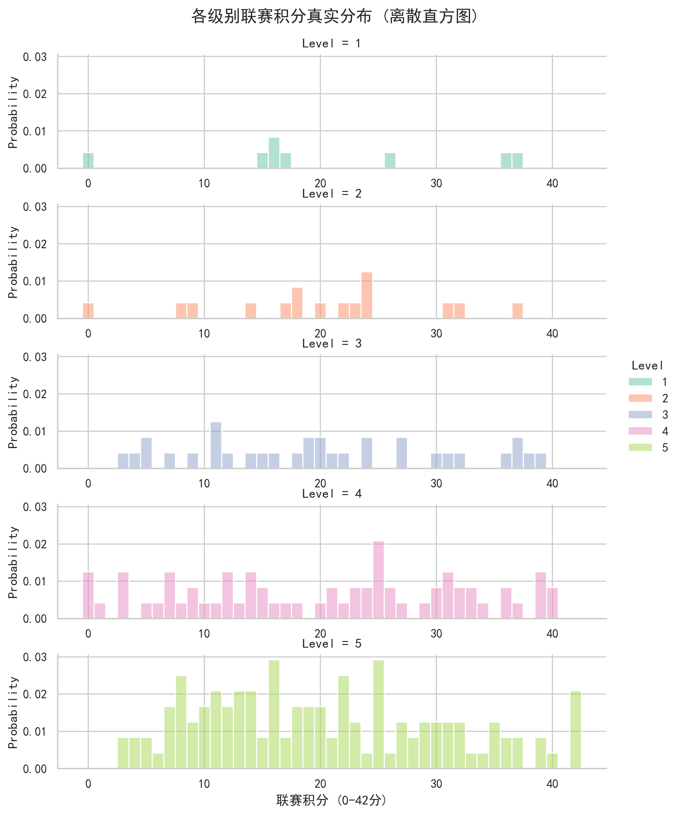
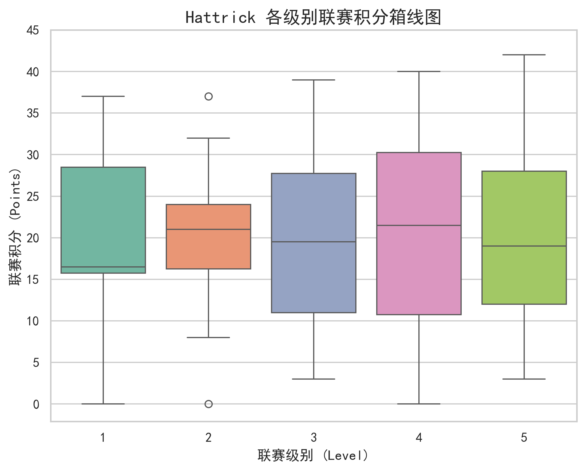

# Hattrick-League-Analysis
A statistical analysis of Hattrick league ecology based on skewness. Just for academic training.
## 📌 Project Background (项目背景)
本项目通过抽样分析 Hattrick 联赛（Level 1-5）的真实积分数据，探究不同级别联赛的竞技生态。

## 📊 Methodology (研究方法)
- **数据来源**：随机抽取中国区 Level 1-5 共 30 个联赛小组的积分数据。
- **核心指标**：
  - `|Skew| <= 0.5` : 均衡竞争型 (生态健康)
  - `Skew > 0.5` : 底层密集型 (右偏，大量低分球队堆积)
  - `Skew < -0.5` : 一强多弱型 (左偏)

## 🏆 Key Findings (核心结论)
1. **Level 3 & 4 是最纯粹的竞技场**：在抽样的中层联赛中，100% 呈现“均衡竞争型”分布。
2. **Level 5 存在适合摆烂**：高达 46.7% (7/15) 的底层联赛呈现“底层密集型（右偏）”。

### 结果汇总表 (Summary Table)
| Level | 一强多弱型 (左偏) | 均衡竞争型 (对称) | 底层密集型 (右偏) |
| :---: | :---: | :---: | :---: |
| **1** | 0 | 1 | 0 |
| **2** | 1 | 1 | 0 |
| **3** | 0 | 4 | 0 |
| **4** | 0 | 8 | 0 |
| **5** | 2 | 6 | 7 |

### 视觉化证明 (Visualizations)
*(图 1：各级别联赛积分真实分布直方图)*


*(图 2：带置信区间缺口的箱线图)*


## 💻 How to Run (如何运行)
本项目基于 Python 编写。确保所有文件在同一目录下，直接运行脚本即可复现上述统计表与图表：
```bash
python ht_pre_experiment.py
